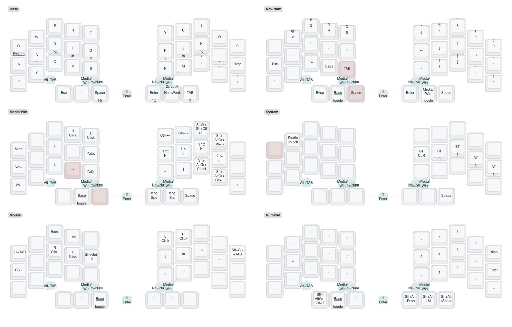

# Crosses/Bridges 36 - dual trackball ZMK config

ZMK firmware configuration for a wireless [Crosses/Bridges](https://ergokeyboards.com/products/crosses-bridges-keyboard-wireless-edition) split keyboard by Good Great Grand Wonderful, built in the 36-key (3x5+3) layout with a PMW3610 trackball under each thumb.

> **Note:** this config targets a Crosses35 with a modified PCB. The pin assignments in `config/boards/shields/` differ from the stock GGGW PCB and will not work on unmodified boards.

## Keymap

Rendered by [keymap-drawer](https://github.com/caksoylar/keymap-drawer); regenerated automatically by GitHub Actions on every keymap change.

## Features

- **Timeless home row mods** ([urob-style](https://github.com/urob/zmk-config)): balanced flavor, 280 ms tapping term, `require-prior-idle-ms`, and positional hold triggers, so mods never misfire during fast rolls. Mac-ordered: Cmd on the index fingers where it belongs.
- **Autoshift alphas**: hold any letter or number for its shifted character, no Shift key needed for capitals.
- **Smart numpad (numword)**: tap the right inner thumb and the right half becomes a physical-style numpad (789 / 456 / 123) that switches itself off after the number, via [zmk-auto-layer](https://github.com/urob/zmk-auto-layer). Double tap locks the pad for data entry, triple tap locks the Nav/Num layer.
- **Dual trackballs**: right ball is the pointer (auto-activates the Mouse layer on movement), left ball scrolls.
- **Mouse layer with mod-clicks**: clicks mirrored on both hands, home row mods stay live for Cmd-click, Shift-click and friends.
- **Combos**: momentary layer access on both hands, Shift+Enter on the inner thumbs, Alt+Tab on A + thumb.
- **ZMK Studio** support on the right half for runtime keymap experiments.

## Layers

| # | Name | Purpose |
|---|------|---------|
| 0 | Base | QWERTY, autoshift, home row mods, F5 (voice input) on Space hold |
| 1 | Nav/Num | Number row with autoshifted symbols, vim-order arrows on the right home row, brackets |
| 2 | Media/Win | Volume, page up/down, macOS Spaces switching, window manager chords |
| 3 | System | ZMK Studio unlock, Bluetooth profile select/clear |
| 4 | Mouse | Auto-activated by the right trackball; clicks, mod-clicks, screenshot |
| 5 | NumPad | Smart numpad targeted by numword; operators on the left home row |

## Hardware

| Component | Specification |
|-----------|---------------|
| MCU | nice!nano v2 (x2) |
| Layout | 36 keys, 3x5+3 columnar split |
| Switches | Kailh Choc, hot-swap |
| Trackballs | 2x 34 mm, PMW3610 sensors |
| Display | SSD1306 128x32 OLED (defined, currently disabled) |

## Trackball configuration

| Ball | Half | Role | Notes |
|------|------|------|-------|
| Right | central | Pointer | CPI 400, jumps to Mouse layer on movement (`automouse-layer`) |
| Left | peripheral | Vertical scroll | CPI 200, scroll mapping applied on-half before BLE |

Driver: [efogdev/zmk-pmw3610-driver](https://github.com/efogdev/zmk-pmw3610-driver) with anti-warp and BLE report rate limiting.

## Module tree

This repo (keymap + pin overrides) imports [johncattrall/gggw-zmk-keebs](https://github.com/johncattrall/gggw-zmk-keebs) (shield definition), which pulls in ZMK v0.3, the PMW3610 driver, report rate limiting, and input processors. [urob/zmk-auto-layer](https://github.com/urob/zmk-auto-layer) provides numword.

## Building

Push to `main` and GitHub Actions builds both halves via the official ZMK build workflow. Download the artifacts from the Actions run:

- `crosses_36_left.uf2`
- `crosses_36_right.uf2` (includes ZMK Studio support)

## Flashing

1. Connect a half over USB.
2. Double-tap its reset button to enter the bootloader (it mounts as a USB drive named `NICENANO`).
3. Copy the matching `.uf2` onto the drive; it flashes and reboots automatically.
4. Repeat for the other half. Flash both halves when the keymap changes.

## Editing the keymap

`config/crosses.keymap` is the source of truth. Edit, push, and CI produces fresh firmware plus an updated keymap diagram. ZMK Studio changes are runtime-only; mirror anything you want to keep back into the keymap file.
